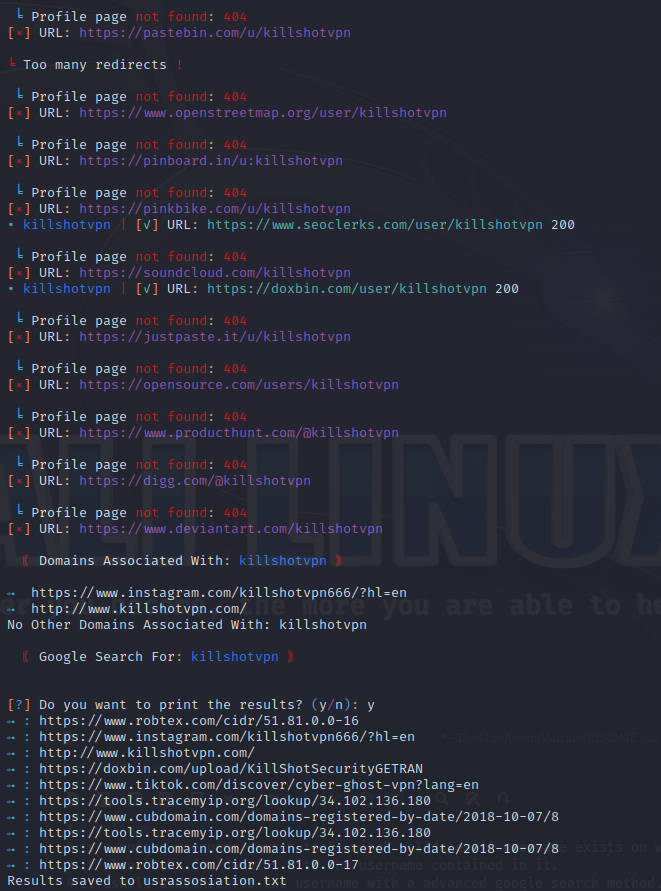

# Vulture
is a unique username search tool witch validates if username exists on websites located in a urls.txt file.
it also looks for domains with the username contained in it.
it aswell searches for the username with a advanced google search method.

Vulture is a very good tool for osint Enthusiasts and forensics professionals.
and has been tested on Windows/Android/Linux for all around user support.



# How to use:
```
git clone https://github.com/AnonCatalyst/Vulture.git
cd Vulture
pip install -r requriments.txt
python vulture.py
```
> [ Vulture ] Has a total of 64 urls to search with and I plan to add more soon.

# Coming Features
> More profile pages to gather information from!

# Issues
> added randomized user agent with connection error handler as an attempt to fix the 429 too many requests issue. i also added platform detection so that if the user is on arch then it will not print the banner

* Problem with error handle for too many google search requests. currently my main priority to fix

# Developers
* Main Developer > AnonCatalyst 
* Optimization & Threads Developer > Gotr00t0day 
